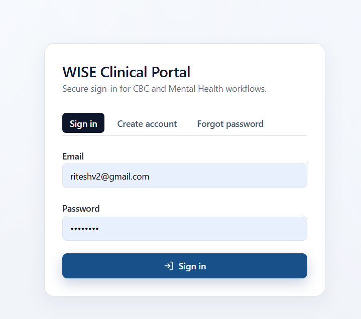
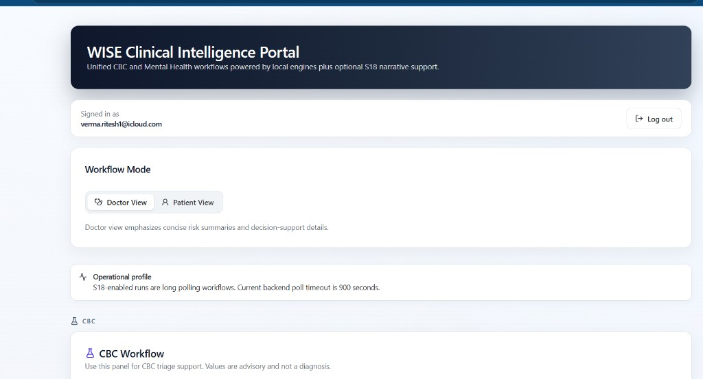

# WISE AI  
### Agentic Clinical Decision & Continued‑Care System (CDSS)


[](
https://github.com/wiseaihub/TSAI-EAG-Capstone/actions/workflows/capstone.yml
)

---

## 📌 Overview

WISE AI is an **Agentic Clinical Decision Support System (CDSS)** designed as part of the  
**TSAI – Extensive AI for Generative Systems Capstone Project**.

It supports **continued care** across patients and doctors through
consent‑based data capture, multi‑agent reasoning, and explainable outputs.
It is designed to work strictly based on user-consent only, assisting both **patients and doctors** across the end‑to‑end healthcare journey — from triage and diagnostics to treatment guidance and continued care.

> ⚠️ This system provides **decision support, not medical automation**.  
> All clinical decisions remain with licensed practitioners.

### About this README: initial vision vs current version

The **original capstone repository layout** described in early TSAI materials (e.g. `plugin/`, `cdss-app/`, `demo/`, `paper/`) reflects the **initial product vision** and roadmap.

**This README** documents the **current version** of the repository: a **FastAPI** backend (`backend/`), a **Vite + React** web app (`frontend/`), Docker deployment under `deployment/docker/`, and the flows implemented today—including CBC and mental health workflows, Mock EHR APIs, optional **S18** narrative support via long‑polling integration, and **Supabase**‑backed sign‑in for the WISE Clinical Portal.

---

## Current UI (WISE Clinical Portal)

The screenshots below show the **current** web experience: secure sign‑in, then the signed‑in **WISE Clinical Intelligence Portal** with Doctor/Patient workflow modes, operational profile (including S18 long‑polling and backend poll timeout messaging), and CBC workflow panels.

**Sign in — WISE Clinical Portal** (CBC and Mental Health workflows; Sign in / Create account / Forgot password)



**Signed in — WISE Clinical Intelligence Portal** (unified CBC and Mental Health workflows; optional S18 narrative support; Doctor vs Patient view)



---

## 🎯 Vision

To build a **responsible, explainable, agentic healthcare assistant**
that supports — but never replaces — licensed clinicians.

WISE AI focuses on:
- Clinical decision support (not diagnosis)
- Patient‑centric continued care
- Human‑in‑the‑loop safety
- Transparent reasoning and confidence feedback

---

## 🎯 Capstone Objective

Design and demonstrate a **production‑thinking AI system** that:

- Uses **agentic architecture** (multiple cooperating AI agents)
- Is **clinically responsible** (decision support, not automation)
- Shows clear **system design, reasoning, and UX**
- Aligns with TSAI capstone dos & don’ts

Primary demo audience: **Rohan Shravan (TSAI)**

---

## 🧠 What This System Is (and Is Not)

### ✅ What It Is
- A **user‑invoked**, consent‑based CDSS
- An **assistive agent** for optimal and efficient care delivery
- Agentic reasoning with confidence & feedback loops
- Designed for both **patients and doctors**

### ❌ What It Is Not
- Not an autonomous medical system
- Not silently monitoring users
- Not writing back to EHR automatically (future only)

---

## 🧩 Core System Components

These items reflect the **conceptual** architecture; the **current** codebase maps to `backend/` (API, Mock EHR, orchestration), `frontend/` (WISE Clinical Portal), and optional integration with **S18** for extended narrative workflows.

1. **WISE AI Plugin (vision / roadmap)**  
   Browser‑based, user‑triggered, consent‑based extraction from EHR views; research and signal capture feeding a shared knowledge bank (not present as a separate top‑level package in the current tree).

2. **WISE AI CDSS Web App (current: `frontend/`)**  
   Standalone web UI for recommendations, clinical summaries, confidence scores, missing‑signal feedback, and orchestration of the agentic reasoning loop. Future or simulated actions are labelled accordingly.

3. **Shared Knowledge Bank**  
   Research and RAG‑style context (platform‑level anonymised context, doctor and patient workspaces as concepts); supports feedback loops and iterative reasoning.

---

## 🤖 Agentic Architecture (High Level)

WISE AI follows a **multi‑agent pattern**, where each agent specializes in a specific reasoning task:

- Symptom Agent
- Lab / CBC Agent
- Trend & History Agent
- Research Agent
- Action / Recommendation Agent

All outputs are synthesized, scored for confidence, and presented for **human approval**.

> 📌 **No agent directly writes to the EHR in MVP** — all actions are advisory.

📐 **Architecture diagrams**  
See under `docs/architecture/` (for example [`docs/architecture/WISE_AI_CDSS_Architecture.md`](docs/architecture/WISE_AI_CDSS_Architecture.md)).

---

🚦MVP Feature Freeze (Capstone Scope)
✅ Included
- Manual invocation via “WISE AI” button in EHR
- Plugin‑based data capture (on demand)
- Multi‑agent reasoning
- CDSS UI with explainable outputs
- Confidence feedback loop
- Simulated future actions (clearly labelled)

❌ Explicitly Out of Scope (These are shown as *future / disabled* features where relevant)
- Automatic EHR write‑back
- Silent background monitoring
- Autonomous actions (lab booking, Rx ordering)
- Production compliance certifications
---

🧪 Demo Philosophy (for TSAI Evaluation)
- Real UI, real flows
- No mock screenshots passed as real
- Clear separation between:
  - Working MVP logic
  - Future extensibility
- Emphasis on **agentic reasoning quality**, not UI polish alone

---

🛠️ Technology Posture (current codebase)

- **Frontend:** React + Vite (`frontend/`), Tailwind‑style UI for WISE Clinical Portal
- **Backend:** FastAPI (`backend/`), Mock EHR and CBC/orchestrator routes
- **AI layer:** LLM‑driven agent orchestration (configurable)
- **Local dev:** Cursor IDE; optional Ollama for local models
- **Demo LLM:** Gemini (mentor‑preferred)
- **Auth:** Supabase (frontend); see frontend env and `deployment/docker` for compose variables
- **Hosting (stretch):** AWS (credits‑based)

---

## 🗓 Project Constraints

- ⏱ 30‑day hard deadline
- 🎓 Academic capstone (design clarity > production scale)
- 🧪 PoC first, extensible architecture second
- 🧑‍⚕️ Clinical responsibility & explainability are non‑negotiable

---

## 👥 Team & Roles

- **Sreedhar Byreeka** — Product Manager & Healthcare IT SME  
- **Ritesh Verma** — Agentic AI & Technical Lead  
- **Mentor:** Rohan Shravan (TSAI)

---

## 📌 Status

🔄 Active development  
📌 MVP feature set frozen  
📐 Architecture finalised  
🧪 Demo & evaluation in progress

---

## 📁 Repository structure

### Initial vision (reference)

Early capstone write‑ups described a layout similar to:

```text
/
├── docs/
├── plugin/                    # Browser plugin (data capture & research)
├── cdss-app/                  # CDSS web app (UI + agents)
├── demo/
├── paper/
├── .github/
└── README.md
```

That structure reflects **roadmap and narrative**; the **current** repository layout below is what this project uses day‑to‑day.

### Current repository layout

```text
/
├── backend/                   # FastAPI app (Mock EHR, CBC, orchestrator)
├── frontend/                  # Vite + React — WISE Clinical Portal
├── deployment/
│   └── docker/                # docker-compose, GHCR, full stack with S18 (see README there)
├── docs/                      # Architecture, API notes, README images
│   └── images/                # Screenshots for this README
├── tests/                     # Backend tests
├── data/
├── .github/
│   └── workflows/             # capstone.yml, backend-ci.yml, docker-publish.yml
└── README.md
```

---

## Local development

**Backend** (from `backend/`):

```bash
pip install -r requirements.txt
uvicorn app.main:app --reload --host 0.0.0.0 --port 8000
```

API docs: [http://localhost:8000/docs](http://localhost:8000/docs)

`/health` now exposes tenancy defaults so deployment posture is explicit:
- `tenancy_tier` (default `starter`)
- `data_region` (default `in`)

**Frontend** (from `frontend/`):

```bash
npm install
npm run dev
```

Dev server uses port **5173** by default (`vite.config.js`). Configure API and Supabase env vars as needed for your environment (see `frontend` and root `.env` patterns used in Docker builds).

---

## Docker (optional)

For building and running with Docker—local compose, images from GHCR, or **full stack** with S18Share—see **[`deployment/docker/README.md`](deployment/docker/README.md)**.

---

## Doctor Provisioning (RBAC)

The portal now enforces app roles:

- `doctor`: can access CBC and mental-health clinical workflows
- `patient`: cannot access doctor-only workflows

Set a provisioning secret in backend env:

```bash
DOCTOR_PROVISION_SECRET=change_me_long_random_value
```

Generate a strong value:

```bash
python backend/scripts/generate_doctor_secret.py
```

Promote a user to doctor (replace values):

```bash
curl -X POST "http://localhost:8000/auth/provision-doctor" \
  -H "Content-Type: application/json" \
  -H "X-Provision-Secret: change_me_long_random_value" \
  -d '{"user_id":"<supabase_user_id>"}'
```

Check current role for a signed-in token:

```bash
curl "http://localhost:8000/auth/me" \
  -H "Authorization: Bearer <access_token>"
```

---

## ⚙️ CI / Automation

Workflows live under `.github/workflows/`, including:

- `capstone.yml` — basic repository checks  
- `backend-ci.yml` — backend CI  
- `docker-publish.yml` — container image publishing  

---

## ⚠️ Disclaimer

WISE AI is a **clinical decision‑support system**.

It does **not** diagnose, prescribe, or replace licensed medical professionals.  
All outputs are advisory and require human clinical judgment.

---

📚 References

- TSAI – The School of AI: https://theschoolof.ai/
- Course: Extensive AI for Generative Systems
- Capstone Guidelines: See `/docs` and uploaded PDFs

---
