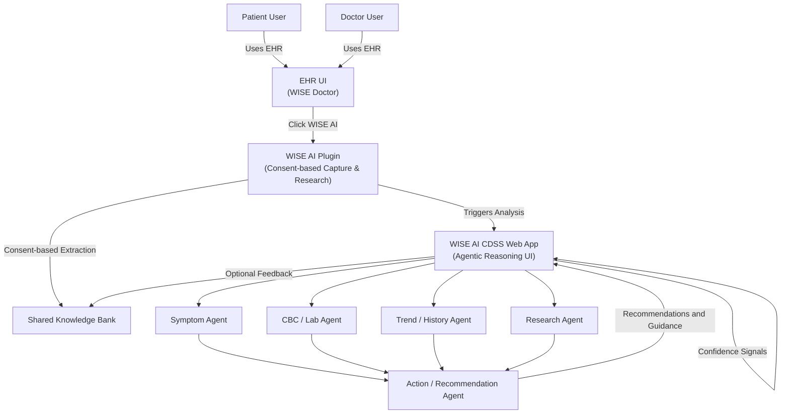

# WISE AI — Agentic Clinical Decision & Continued‑Care System (CDSS)

> **Purpose**: This document is the single source of truth for  
> architecture, scope boundaries, and demo behavior for the TSAI Capstone.

## 0. One‑Line Vision
WISE AI is an agentic Clinical Decision & Continued‑Care System that augments
patients and doctors by synthesizing patient context, research signals, and
platform intelligence — delivering explainable recommendations, clinical
assistance, and continuous‑care support.

---

## 1. System Positioning
WISE AI operates as a **standalone AI system** that overlays existing EHR
workflows (WISE Doctor) without tightly coupling to them.

• No EHR core refactor required  
• Consent‑driven, user‑initiated invocation  
• API‑level or browser‑level integration only  
• Production‑safe by design  

---

## 2. Core Components

### 2.1 CDSS Web Application (Primary UI)
A standalone web application that:
- Accepts curated patient/doctor context
- Synthesizes signals using agentic reasoning
- Displays outputs with explanations & confidence
- Showcases stretch actions (future‑flagged)

Outputs:
- Patient recommendations (diet, diagnostics, escalation)
- Doctor assistance (clinical notes, diagnosis hints, safety flags)
- Confidence scores & feedback loop insights

---

### 2.2 Browser Plugin (Data & Research Adapter)
A **user‑triggered extension** that:
- Extracts consented on‑screen data from EHR views
- Parses PDFs, vitals tables, structured forms
- Performs live research (WWW + curated sources)
- Writes to the shared knowledge bank

No background scraping  
No silent monitoring  
Explicit user action only  

---

### 2.3 Shared Knowledge Bank
Logical layers:
1. Public research (WWW, guidelines)
2. WISE platform intelligence (anonymized)
3. Doctor workspace (optional contribution)
4. Patient‑specific context (highest priority)

Used by:
- CDSS reasoning agents
- Research agent (plugin)
- Confidence feedback loop

---

## 3. Agentic Architecture (Conceptual)

- Orchestrator Agent
- Context Synthesis Agent
- Research Agent
- Clinical Reasoning Agent
- Safety & Explainability Agent
- Confidence Scoring Agent
- Action Simulator (future‑flagged)
- All agents operate under a central Orchestrator with deterministic execution for demo

Agents collaborate but **do not act autonomously** in MVP.

---

## 4. Invocation Model

1. User clicks **“WISE AI”** button in EHR
2. Plugin captures consented context
3. Data written to Knowledge Bank
4. CDSS Web App opens in new tab
5. Agentic reasoning executes
6. Outputs rendered with sources & confidence

---

## 5. MVP Guardrails (Hard‑Locked)

- No background processing
- No automatic EHR writes
- No autonomous actions
- No medical claims
- Human‑in‑the‑loop always

---

## 6. Stretch Goals (Demo‑Only, Simulated)

- Send clinical note back to EHR (preview)
- Trigger follow‑up reminders (preview)
- Suggest lab orders (preview)
- Compliance tracking dashboard (preview)

Clearly labeled: **“Future Capability”**

---

## 7. Why This Architecture Works for Capstone

- Demonstrates real agentic design
- Meets TSAI explainability expectations
- Shows production realism without risk
- Scales cleanly post‑capstone

---

## 8. Architecture Diagram (Rendered)

---

## 9. Architecture Diagram (Mermaid – Source)

---

## 10. Status
This document represents the **frozen architecture baseline** for:
- MVP feature freeze
- Capstone demo
- Phases 0–2 execution

Any changes require explicit review.
